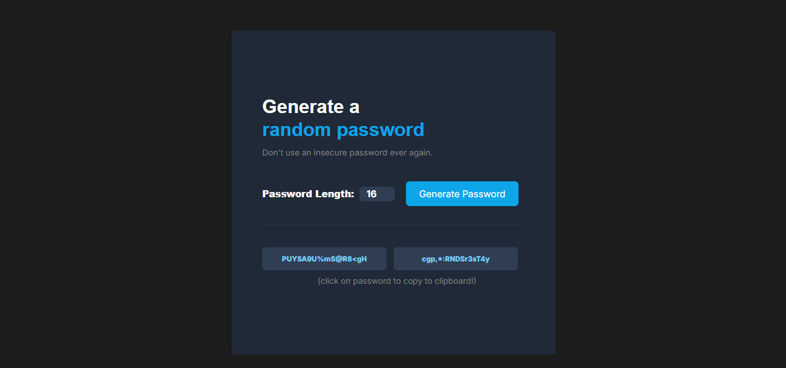

# Random Password Generator

This is a simple web application that generates random passwords. It's built with HTML, CSS, and JavaScript.

## Features

*   **Generate Random Passwords:** Create strong, random passwords with the click of a button.
*   **Customizable Length:** Choose a password length between 8 and 20 characters.
*   **Two at a Time:** Generates two different password options at once.
*   **Copy to Clipboard:** Easily copy a generated password to your clipboard by clicking on it.

## Technologies Used

*   HTML
*   CSS
*   JavaScript

## Web

URL: https://github.com/mercurialw0rld/random_password_generator/deployments/github-pages

